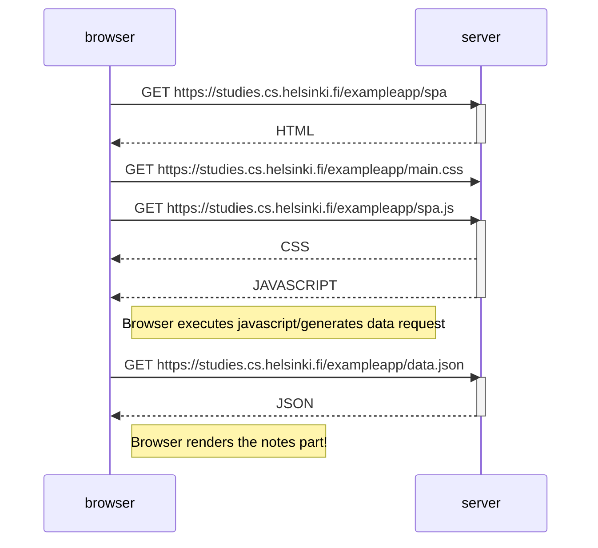

```mermaid

sequenceDiagram
participant browser
participant server

    browser ->> server: GET https://studies.cs.helsinki.fi/exampleapp/spa
    activate server
    server -->> browser: HTML
    deactivate server

    browser ->> server: GET https://studies.cs.helsinki.fi/exampleapp/main.css
    browser ->> server: GET  https://studies.cs.helsinki.fi/exampleapp/spa.js
    activate server
    server -->> browser: CSS
    server -->> browser: JAVASCRIPT
    deactivate server

    note right of browser: Browser executes javascript/generates data request
    browser ->> server: GET  https://studies.cs.helsinki.fi/exampleapp/data.json
    activate server
    server -->> browser: JSON
    deactivate server
    note right of browser: Browser renders the notes part!

```
