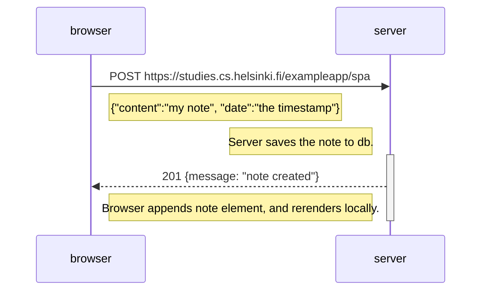

```mermaid

sequenceDiagram
participant browser
participant server

    browser->>server: POST https://studies.cs.helsinki.fi/exampleapp/spa
    note right of browser: {"content":"my note", "date":"the timestamp"}
    note left of server: Server saves the note to db.

    activate server
    server-->> browser: 201 {message: "note created"}
    note right of browser: Browser appends note element, and rerenders locally.
    deactivate server

```
